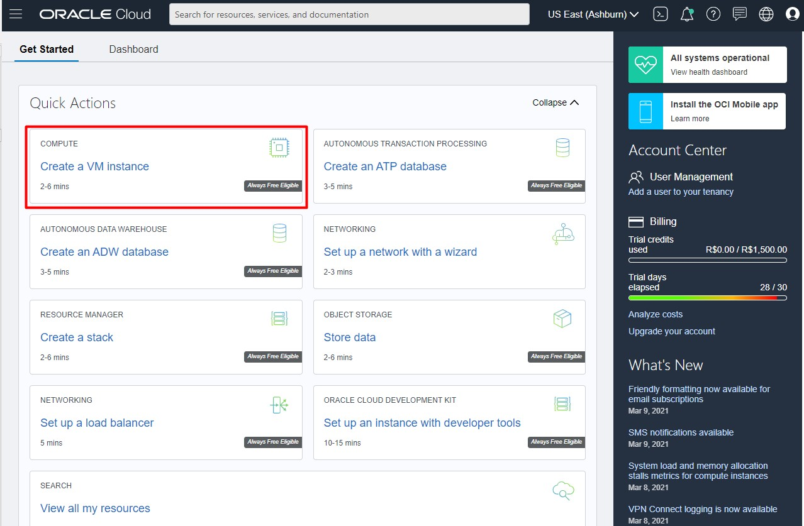
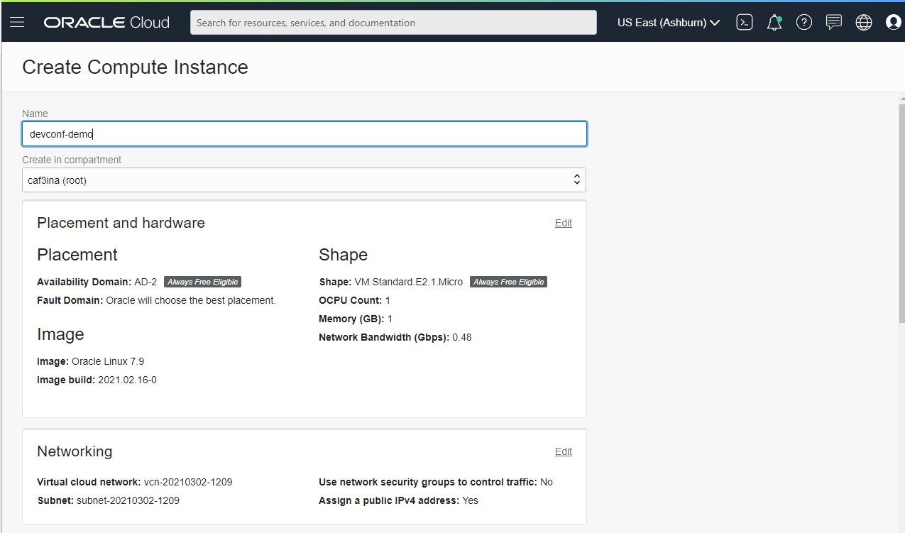
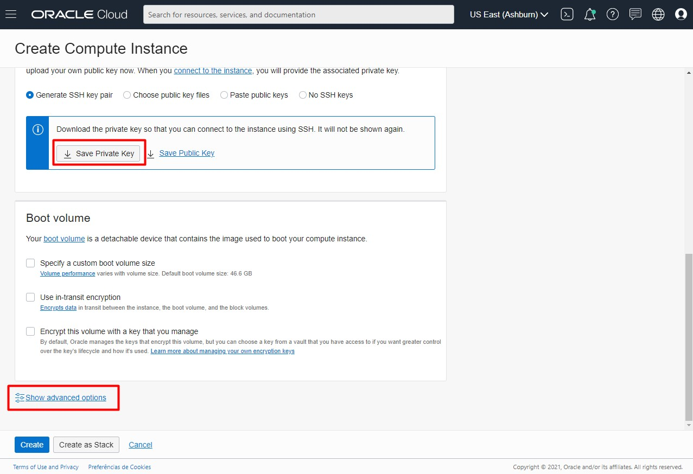
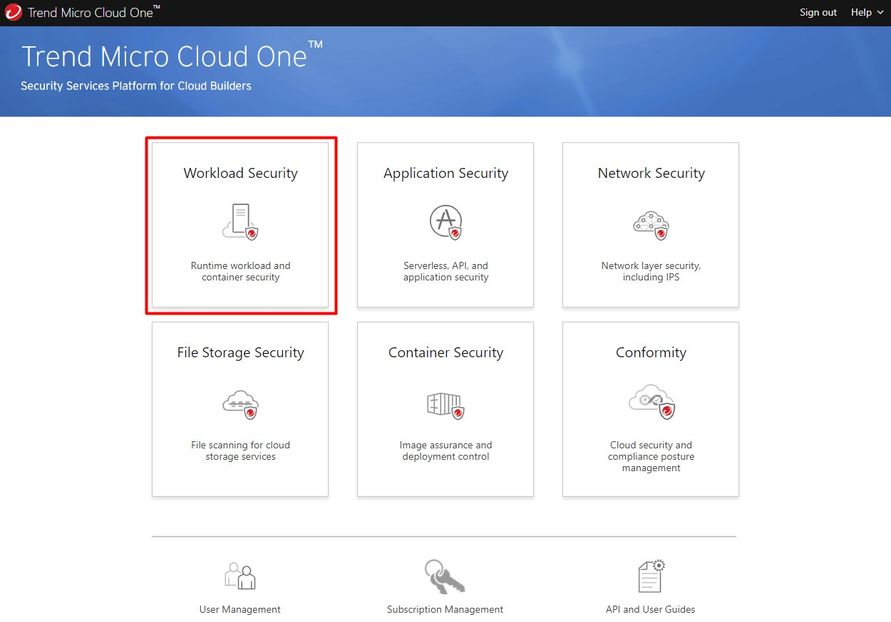
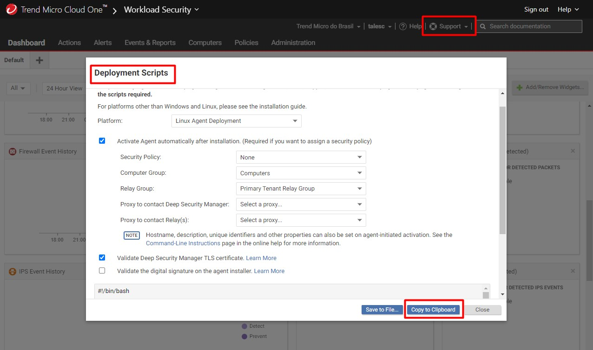
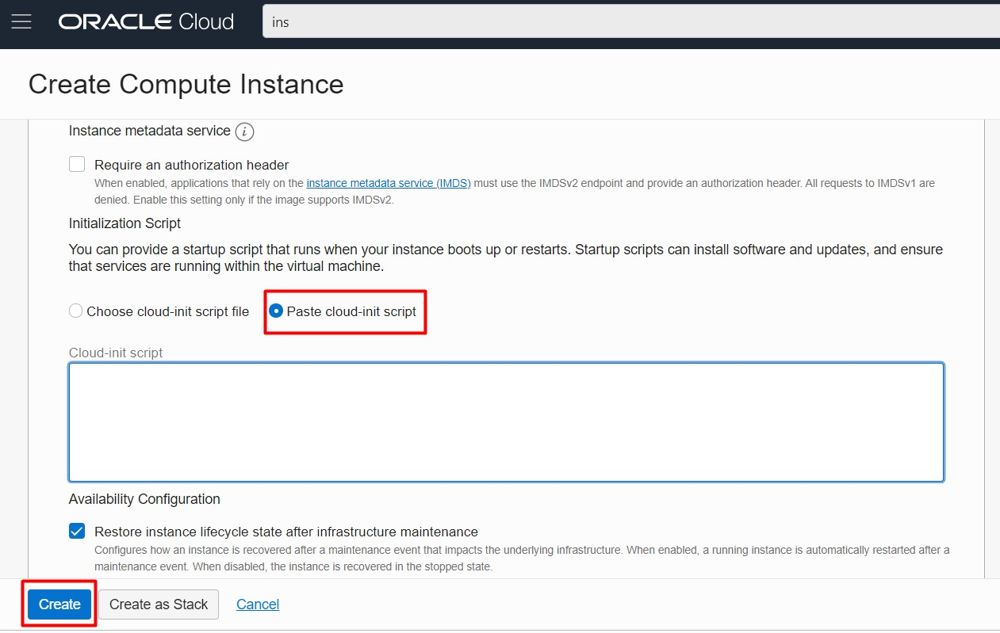
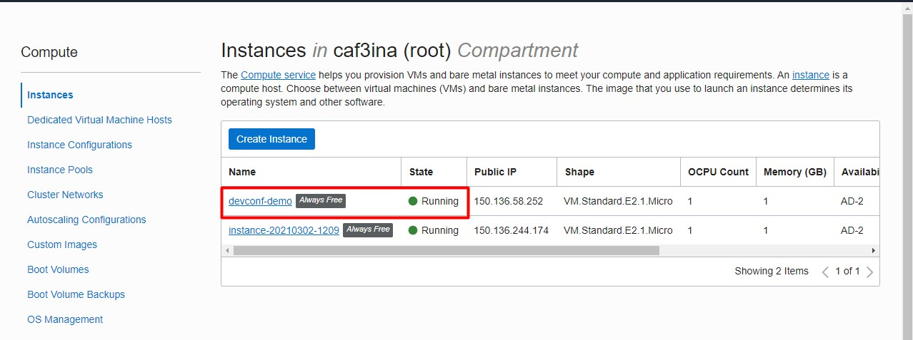
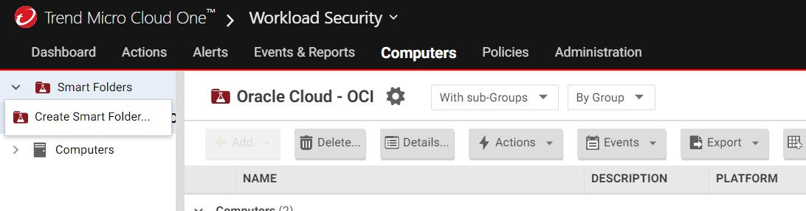
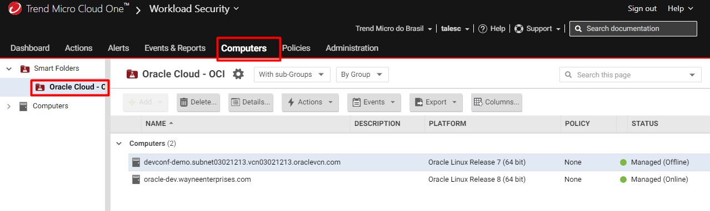
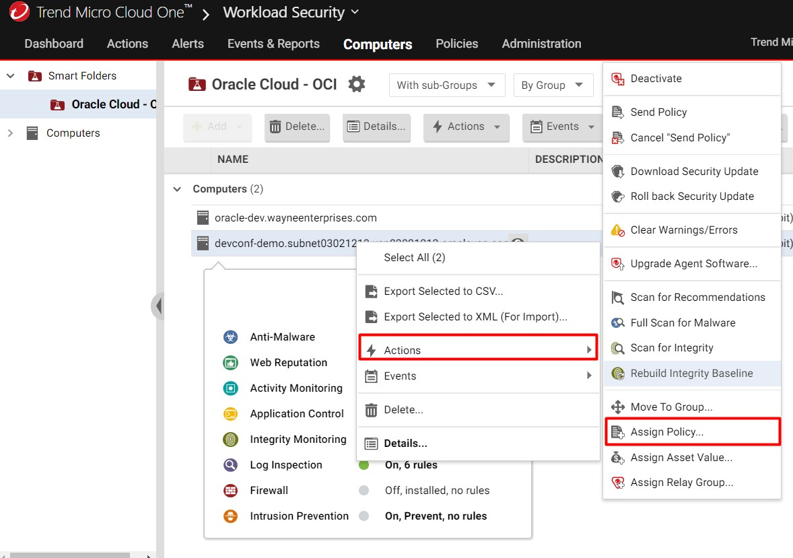

# Protegendo um Servidor na Oracle Cloud

# Pré-req para o ambiente

* Cria uma conta no Oracle Cloud (free)
https://cloud.oracle.com

* Cria uma conta no Cloud One (free)
https://cloudone.trendmicro.com/

# Provisionando uma VM (Oracle Cloud)

Navegue no menu direito até Compute > Instances também é possível usar a visualização no meu principal como o exemplo abaixo:

 </img>

Defina um nome para seu workload, faça o download das chaves privadas para uma conexão futura via ssh.

 </img>

Clique em show advanted options, iremos colocar um script na inicialização do servidor dessa forma realizando a instalação do agente do Cloud One Workload Security.

 </img>

Acessar a plataforma Cloud One (a conta deve ser criada previamente) e escolher a opção Workload Security

 </img>

No meu Support selecione a opção Deployment Scripts, selecione a Plataforma "Linux Agent Deployment" e clique em "Copy to Clipboard", iremos copiar o script de instalação e colocar na inicialização do Servidor.

 </img>

Novamente na console do OCI, selecione a opção "Paste cloud-init script" e cole o script gerado a partir da console do Cloud One. Após isso selecione create e aguarde alguns minutos até a inicialização do Servidor.

 </img>

 </img>

Enquanto o Servidor é inicilizado iremos criar uma Smart Folder para Organizarmos nosso ambiente. Acesse novamente a console do Cloud One e navegue no meu conforme abaixo no menu Computers > Smart Folde > Create Smart Folder.

 </img>

Com o Servidor já inicializado é possível visualizarmos no Cloud One, nesse exemplo tenho dois Servidores um on-premise e outro criado anteriormente.

 </img>

Para finalizar, aplique uma politica no Servidor, clique com o botão direito "Actions" e "Assign Policy"

 </img>
